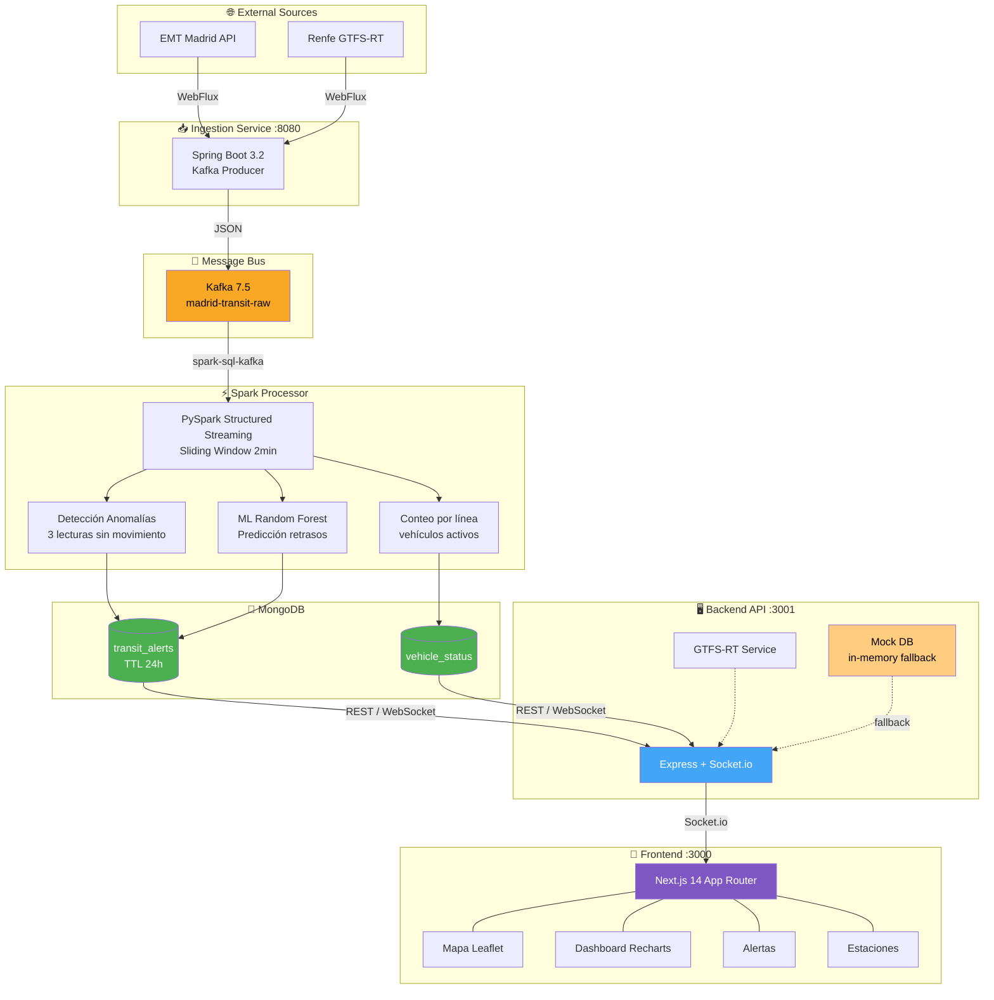

# Arquitectura Madrid Transit Pulse

```mermaid
graph TB
    subgraph "🌐 External Sources"
        EMT[EMT Madrid API]
        RENFE[Renfe GTFS-RT]
    end

    subgraph "📥 Ingestion Service :8080"
        SB[Spring Boot 3.2<br/>Kafka Producer]
    end

    subgraph "📨 Message Bus"
        KAFKA[Kafka 7.5<br/>madrid-transit-raw]
    end

    subgraph "⚡ Spark Processor"
        SPARK[PySpark Structured Streaming<br/>Sliding Window 2min]
        ANOM[Detección Anomalías<br/>3 lecturas sin movimiento]
        ML[ML Random Forest<br/>Predicción retrasos]
        COUNT[Conteo por línea<br/>vehículos activos]
    end

    subgraph "💾 MongoDB"
        ALERTS[(transit_alerts<br/>TTL 24h)]
        STATUS[(vehicle_status)]
    end

    subgraph "🖥️ Backend API :3001"
        EXP[Express + Socket.io]
        MOCK[Mock DB<br/>in-memory fallback]
        GTFS[GTFS-RT Service]
    end

    subgraph "🎨 Frontend :3000"
        NEXT[Next.js 14 App Router]
        MAP[Mapa Leaflet]
        DASH[Dashboard Recharts]
        ALERT[Alertas]
        EST[Estaciones]
    end

    EMT -->|WebFlux| SB
    RENFE -->|WebFlux| SB
    SB -->|JSON| KAFKA
    KAFKA -->|spark-sql-kafka| SPARK
    SPARK --> ANOM
    SPARK --> ML
    SPARK --> COUNT
    ANOM --> ALERTS
    ML --> ALERTS
    COUNT --> STATUS
    ALERTS -->|REST / WebSocket| EXP
    STATUS -->|REST / WebSocket| EXP
    GTFS -.-> EXP
    MOCK -.->|fallback| EXP
    EXP -->|Socket.io| NEXT
    NEXT --- MAP
    NEXT --- DASH
    NEXT --- ALERT
    NEXT --- EST

    style KAFKA fill:#f9a825,color:#000
    style ALERTS fill:#4caf50,color:#fff
    style STATUS fill:#4caf50,color:#fff
    style MOCK fill:#ffcc80,color:#000
    style EXP fill:#42a5f5,color:#fff
    style NEXT fill:#7e57c2,color:#fff
```
